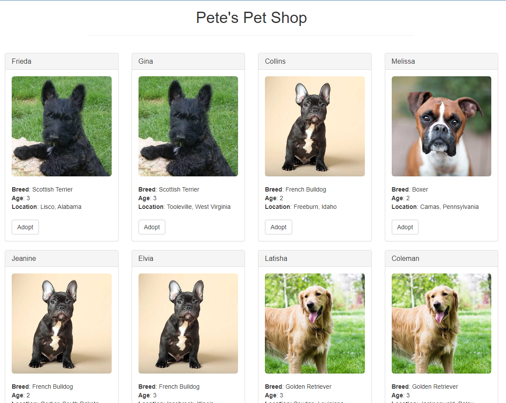

# BLOCKCHAIN CODES

## Youtube  building a blckchain under 15 min
https://www.youtube.com/watch?v=baJYhYsHkLM

I am coding a python port of what was represented in the video.

## Pet shop tutorial

http://trufflesuite.com/tutorial/

test passing.

Website is up: 

`npm run dev` to start the site.

Cant connect the wallet to gnache. 

connected the wallet from https://ethereum.stackexchange.com/questions/76858/metamask-testrpc-shows-0-ether-while-connecting-to-ganache-cli/116776#116776

when nothing happens on click

start truffle develop on another terminal

in truffle develop wehenver I am typing in adoption the site point to localhost 8545 though gnache address is localhost 7545.

## Understanding blockchains

Layman terms :  https://thehustle.co/how-are-bitcoin-created/

Proof of work : the computation miner does that assigns a particular code.

When bitcoin mining first started, the reward was 50 bitcoin (BTC). But as dictated by the coin’s creator, the reward is cut in half every time 210k new blocks are added to the chain — or roughly every 4 years.

Last bitcoin be mined by 2140, therefore it is exponentially more computation heavy to mine more bitcoins.

Technical tidbits about ethereum:
https://ethereum.org/en/developers/docs/intro-to-ethereum/

