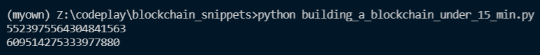
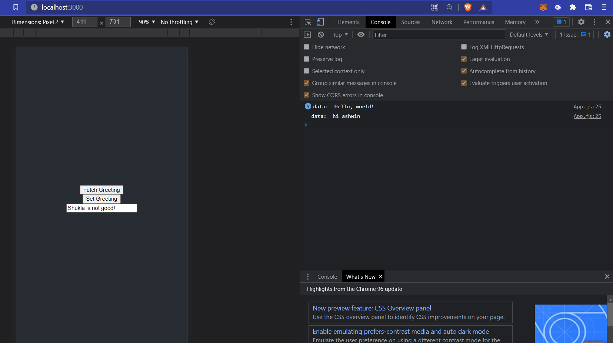
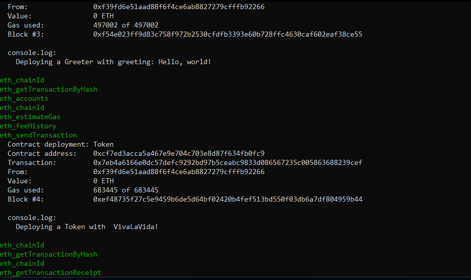
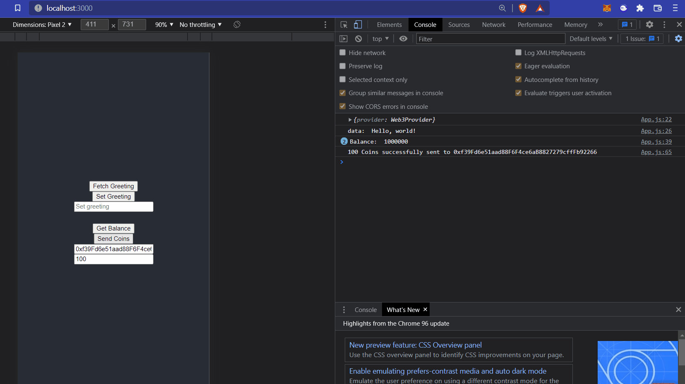
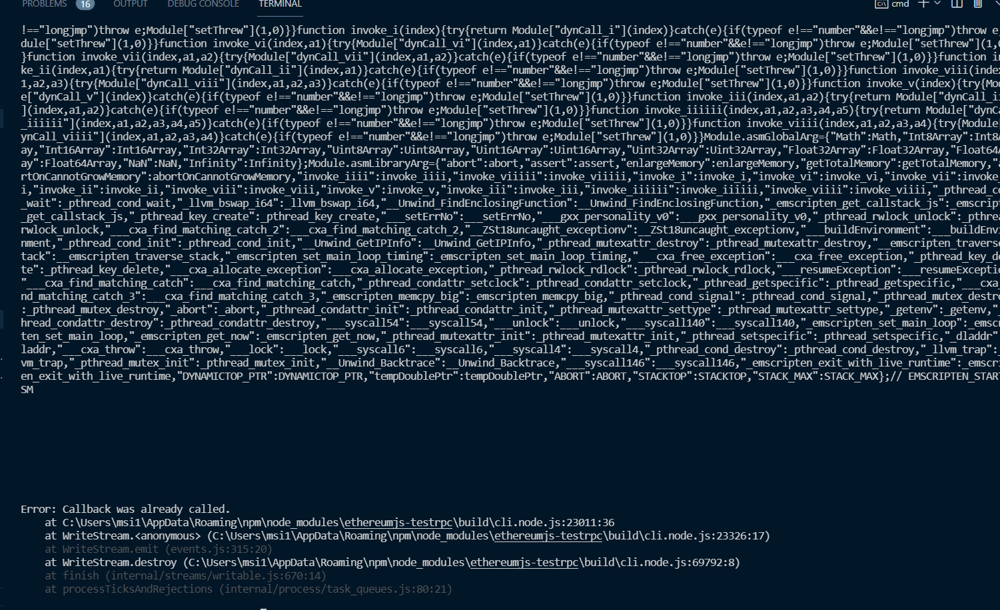

_________________________________________
# Building a blockchain under 15 min




______________________________________

# Full stack etherium react dapp

### Installing dependencies

```
yarn install ethers hardhat @nomiclabs/hardhat-waffle ethereum-waffle chai @nomiclabs/hardhat-ethers
```

```
npm install --save-dev "hardhat@^2.8.0" "@nomiclabs/hardhat-waffle@^2.0.0" "ethereum-waffle@^3.0.0" "chai@^4.2.0" "@nomiclabs/hardhat-ethers@^2.0.0" "ethers@^5.0.0"
```

## Hardhat development environment

hardhat.config.js - The entirety of your Hardhat setup (i.e. your config, plugins, and custom tasks) is contained in this file.
scripts - A folder containing a script named sample-script.js that will deploy your smart contract when executed
test - A folder containing an example testing script
contracts - A folder holding an example Solidity smart contract

```
(myown) Z:\codeplay\blockchain_snippets\full_stack_etherium\react-dapp>npx hardhat run scripts/deploy.js --network localhost
Greeter deployed to: 0x5FbDB2315678afecb367f032d93F642f64180aa3
```



After token deployment



```
(myown) Z:\codeplay\blockchain_snippets\full_stack_etherium\react-dapp>npx hardhat run scripts/deploy.js --network localhost
Compiling 1 file with 0.8.4
Compilation finished successfully
Deploying contracts with the account. 0xf39Fd6e51aad88F6F4ce6aB8827279cffFb92266
Greeter deployed to: 0x9fE46736679d2D9a65F0992F2272dE9f3c7fa6e0
Token deployed to  0xCf7Ed3AccA5a467e9e704C703E8D87F634fB0Fc9
```




______________________________________
# Movie rating app

Not able to connect movie rating app



# PoS, PoW and Other blockchain networks

https://medium.com/hackernoon/pos-pow-and-12-other-blockchain-protocols-you-didnt-know-about-3634b089d119

# solanan consensus mechanism


