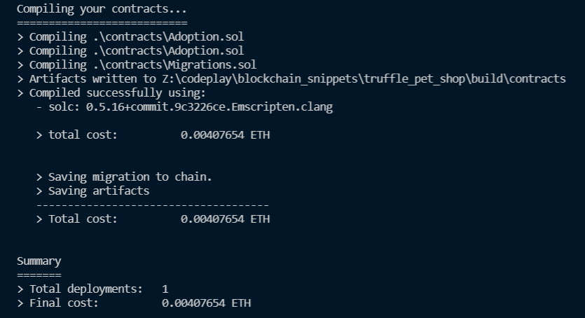

# BLOCKCHAIN CODES

## Youtube  building a blckchain under 15 min
https://www.youtube.com/watch?v=baJYhYsHkLM

I am coding a python port of what was represented in the video.

## Build a defi app
https://www.youtube.com/watch?v=CgXQC4dbGUE

prerequisites
1. Nodejs
2. Ganache
Tobe continued.

## Truffle pet shop
https://www.trufflesuite.com/tutorial

Blockchain basics:
https://trufflesuite.com/guides/ethereum-overview

Ganache simulates an etherium blockchain. It can be achieved in a non gui manner using truffle.

After migration, the app can be deployed to a public network.

