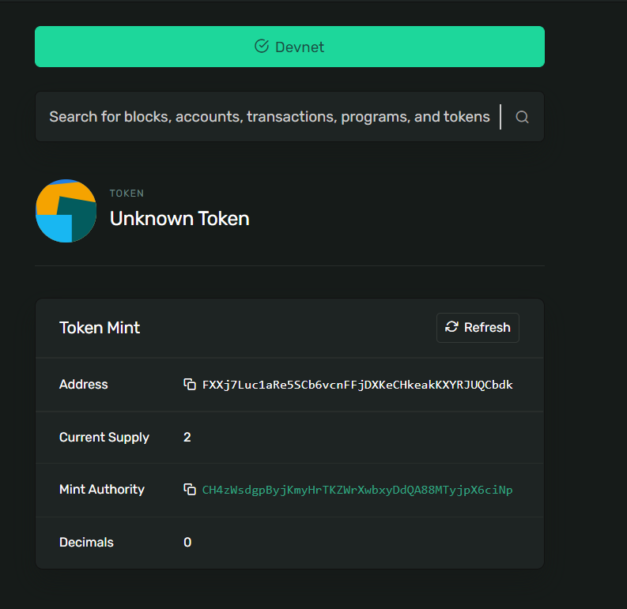

# BLOCKCHAIN CODES
env: myown

## Youtube  building a blckchain under 15 min
https://www.youtube.com/watch?v=baJYhYsHkLM

I am coding a python port of what was represented in the video.

## Build a defi app
https://www.youtube.com/watch?v=CgXQC4dbGUE

prerequisites
1. Nodejs
2. Ganache
Tobe continued.

## Truffle pet shop
https://www.trufflesuite.com/tutorial

Blockchain basics:
https://trufflesuite.com/guides/ethereum-overview

Ganache simulates an etherium blockchain. It can be achieved in a non gui manner using truffle.

After migration, the app can be deployed to a public network.

# building a movie rating app

https://medium.com/@takleakshar/how-to-build-a-decentralized-full-stack-app-in-ethereum-and-react-42e63d45a208

Etherium is transaction based state machine

It is cryptographicaly secure

with shared state

https://preethikasireddy.medium.com/how-does-ethereum-work-anyway-22d1df506369

For a transaction to be considered valid, it must go through a validation process known as mining. Mining is when a group of nodes (i.e. computers) expend their compute resources to create a block of valid transactions.

“GHOST” = “Greedy Heaviest Observed Subtree”
In simple terms, the GHOST protocol says we must pick the path that has had the most computation done upon it.

Truffle console is to interact with the blockchchain.

Cant connect to tet rpc error:

Any node that wants to verify a piece of data can use something called a “Merkle proof” to do so. A Merkle proof consists of:
A chunk of data to be verified and its hash
The root hash of the tree
The “branch” (all of the partner hashes going up along the path from the chunk to the root)

# creating a solana nft

