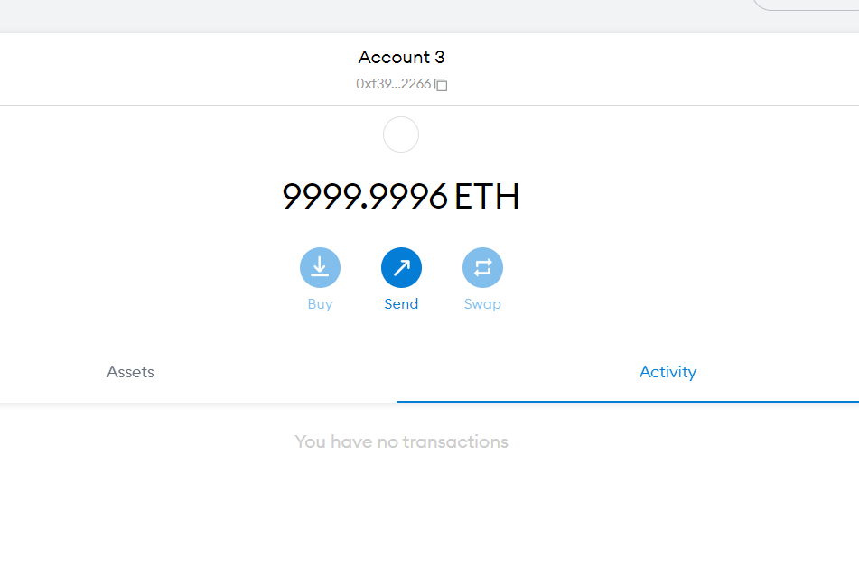

## Dependencies

yarn install ethers hardhat @nomiclabs/hardhat-waffle ethereum-waffle chai @nomiclabs/hardhat-ethers

What is an ABI? ABI stands for application binary interface. You can think of it as the interface between your client-side application and the Ethereum blockchain where the smart contract you are going to be interacting with is deployed.

## connected the metmask network to hardhat wallet

connected at 31337 it was possible because of changes in hardhat.config.js

Next : connecting to a react client

