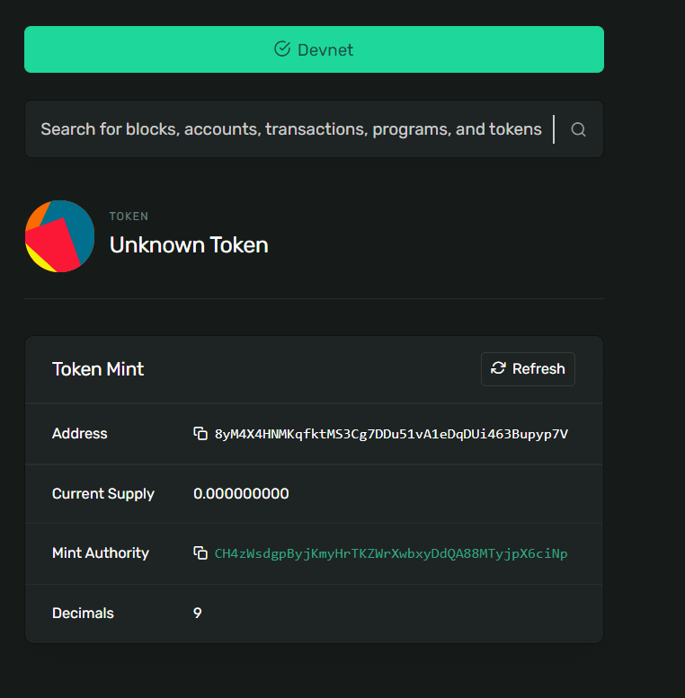
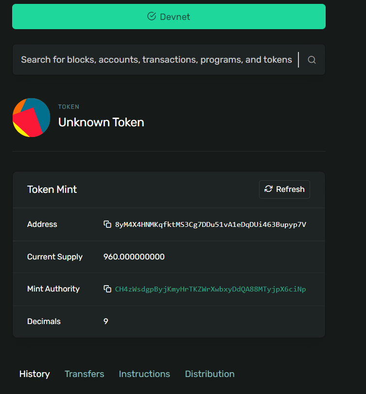

# from Zappyshare

https://zappycode.com/tutorials/create-your-own-token-and-nft-on-solana

```
(myown) Z:\codeplay\blockchain_snippets\solana_nft_and_token>solana-keygen new --outfile SolananWallet/my-keypair.json
Generating a new keypair

For added security, enter a BIP39 passphrase

NOTE! This passphrase improves security of the recovery seed phrase NOT the
keypair file itself, which is stored as insecure plain text

BIP39 Passphrase (empty for none):
Enter same passphrase again:

Wrote new keypair to SolananWallet/my-keypair.json
===========================================================================
pubkey:
===========================================================================
Save this seed phrase and your BIP39 passphrase to recover your new keypair:
praise six layer vicious win evil country narrow inflict ladder double kite
===========================================================================

```

official documentation: 
https://spl.solana.com/token

Token before minting

```
solana config set --url https://devnet.solana.com
solana config set --keypair SolanaWallet/my-keypair.json
spl-token create-token

```



Token after minting

```
spl-token create-account YOUR_TOKEN
spl-token mint YOUR_TOKEN 420
```



NFT token

```
spl-token create-token --decimals 0
spl-token create-account YOUR_NFT_TOKEN
spl-token mint YOUR_NFT_TOKEN 1
spl-token authorize YOUR_NFT_TOKEN mint --disable
```

